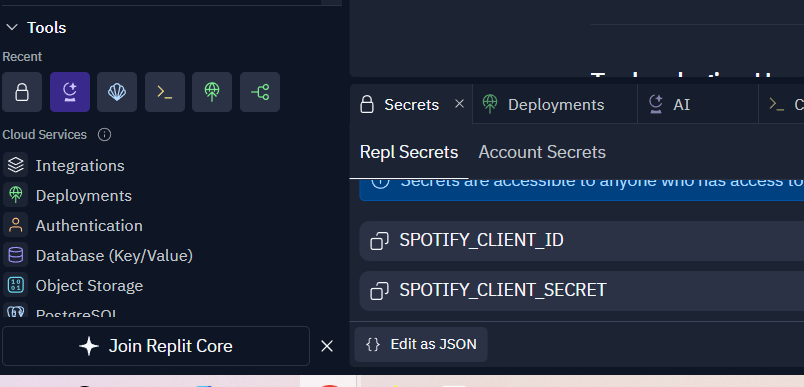
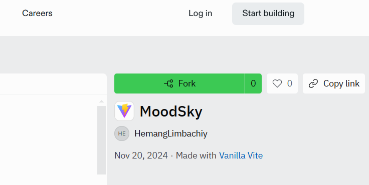
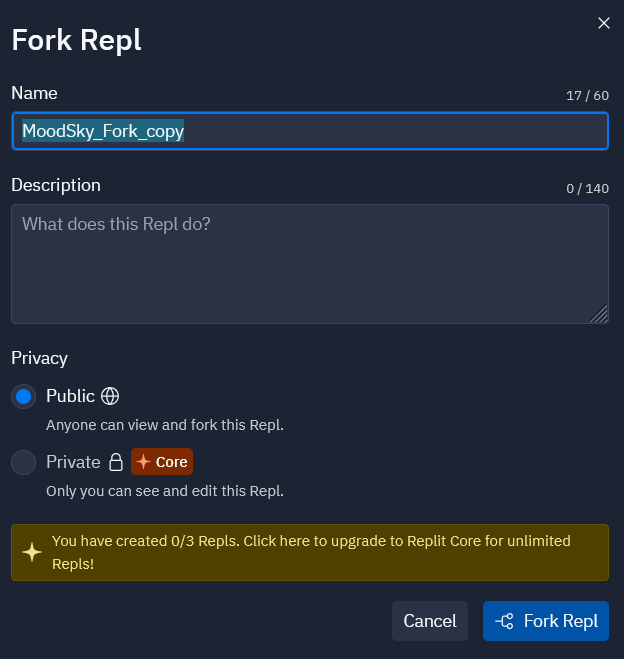
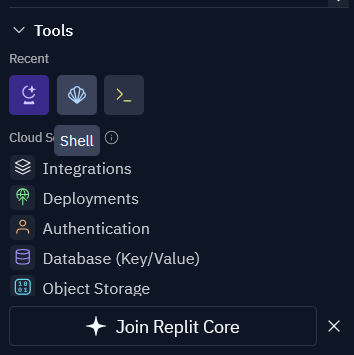
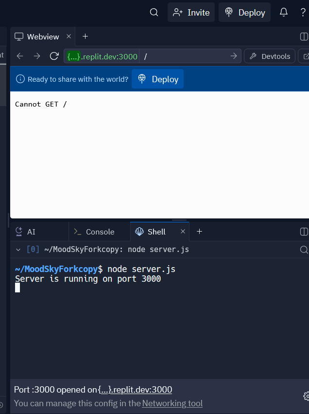
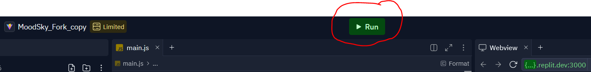
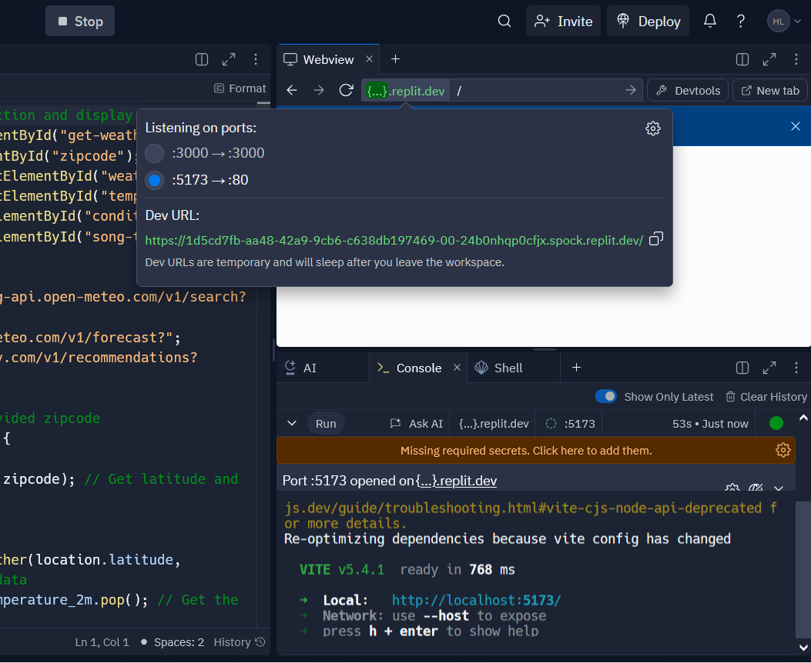
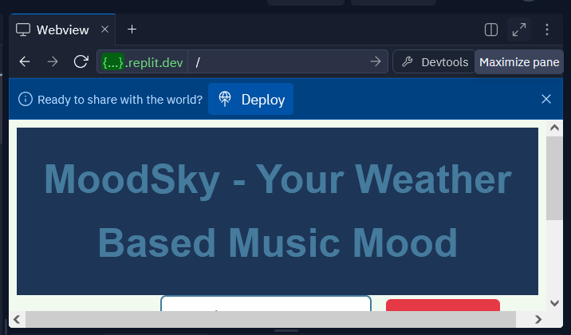
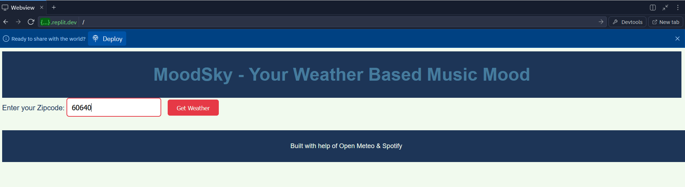
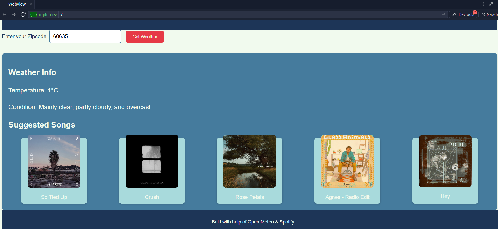

# Mood Music - Weather and Music Recommendation App 🎵🌤️

Tired of searching for the perfect playlist? Let the weather do the work! MoodSky suggests music based on real-time weather, so you can enjoy songs that match the vibe of your day, whether sunny, rainy, or anything in between. A simple web application that combines real-time weather information and music recommendations. Enter a ZIP code to view the current weather and get a curated playlist to match the mood of the weather.

## Features 🚀

- **Weather Information**: Displays temperature and weather conditions based on your ZIP code.
- **Music Recommendations**: Get a list of songs tailored to match the current weather mood.
- **Interactive UI**: Smooth, simple, responsive, and easy-to-use interface.
---

## Technologies Used
- **Backend**: 
  - **Node.js** with **Express.js** for server-side logic (very basic implementations)
  - **Spotify API** for fetching music recommendations.
  - **Open-Meteo API** for fetching weather data.
  - **dotenv** for environment variable management. (Becuase Vite you know)

- **Frontend**:
  - Built using **Vite Vanilla Template** for fast and modern frontend development.
  - **HTML**, **CSS** for the layout and styling.
---

# Tools and Templates used

- ** Github (also including Github pages)
- ** Replit (Vanilla-Vite template)
- ** Vite ⚡ {
    > Next Generation Frontend Tooling
    
    All you need to do is hit run and start making changes which will be updated live.
    
    You can add install and use npm packages, you can use the Packager tool to search and manage your packages.
    
    [Read the Docs to Learn More](https://vitejs.dev) and configure your frontend application.}
---

# APIs used
- ** Open-Meteo – a weather API
- ** Spotify – a music API (requires a free Spotify account and use of an access token)
---

## File Structure
- `server.js`: Backend logic for API integration.
- `main.js`: Frontend JavaScript file for client-side interactions.
- `index.html`: The main HTML file for the web interface.
- `styles.css`: CSS for the project's styling.
- `package.json` and `package-lock.json`: Node.js dependency management files.
- `vite.config.js`: Configuration for the Vite frontend development server.

---

## Try It Online
You can try the app directly on Replit: https://replit.com/@HemangLimbachiy/MoodSky 

# Tutorial 

** Presteps: Go to the spotify API link and make a developer account by following these getting started steps in this link. https://developer.spotify.com/documentation/web-api 
** For the 'Redirect URL portion' you can add the "link of the forked replit of your own copy" in there from the above section. This will help you get your own unique client id and client secret.

** Step 0: Go to the Secrets tab of the replit and save your client id and secret as such.
    
    
** Step 1: Go to the replit link in the 'try it online' step above.  
** Step 2: Click on the green 'fork' button on the top-right corener. This will make a personal copy for you. But you might have make a Replit account if you don't have one.
    
** Step 3: Rename it to "MoonSky_Fork_copy" and then click 'Fork Repl' as shown in this image.
    

** Step 4: Click on Shell on the bottom-left corver under the Tools. look at this image for reference
    

** Step 5: Type in command "node server.js". This is will open a webview tab on top-right.
    

** Step 6: now click "RUN" at the top center of the page.
    

** Step 7: now click on the {...} green icon on the webview pane and change the ports to 5173-->80.
    
    
** Step 8: maximize the pane using the opposite diagonal arrows.
    

** Step 9: Type in the zipcode and "click" the 'Get Weather button'.
    

** Step 10: this should be the output you should be getting.
    
    

    

# Contact 📧
Hemang Limbachiya
GitHub: hlimbachiya1 (Hawkybrain)
